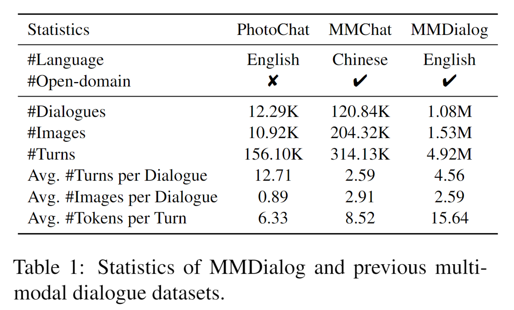
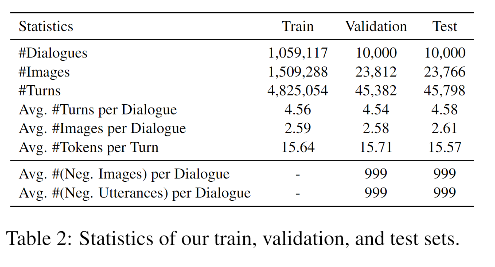
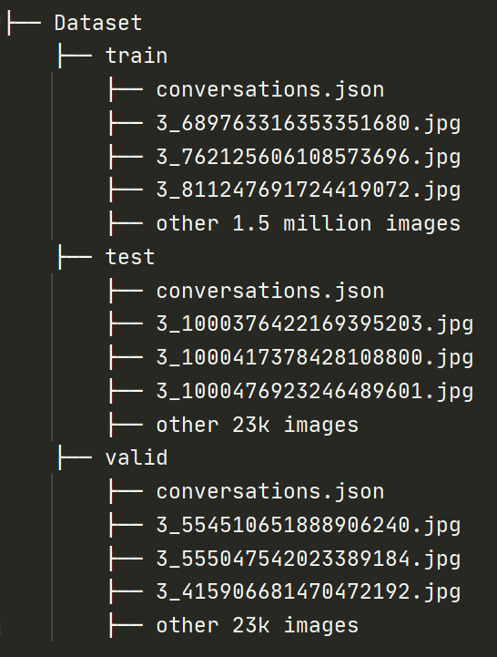
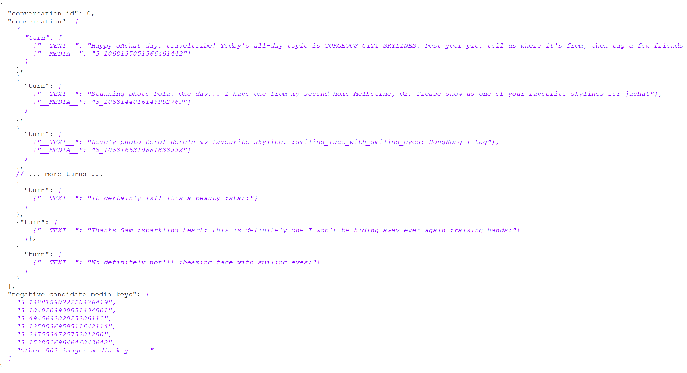

# MMDialog: A Large-scale Multi-turn Dialogue Dataset Towards Multi-modal Open-domain Conversation #


This repository is the official site of [MMDialog: A Large-scale Multi-turn Dialogue Dataset Towards Multi-modal Open-domain Conversation](https://arxiv.org/abs/2211.05719)

## About the dataset

**A Dialogue Case of MMDialog:**


**Statistics:**





If you use it in your work, please cite our paper:
 [](https://arxiv.org/abs/2211.05719) [](https://arxiv.org/abs/2211.05719)

```
@misc{https://doi.org/10.48550/arxiv.2211.05719,
  doi = {10.48550/ARXIV.2211.05719},
  url = {https://arxiv.org/abs/2211.05719},
  author = {Feng, Jiazhan and Sun, Qingfeng and Xu, Can and Zhao, Pu and Yang, Yaming and Tao, Chongyang and Zhao, Dongyan and Lin, Qingwei},
  keywords = {Computation and Language (cs.CL), Artificial Intelligence (cs.AI), Computer Vision and Pattern Recognition (cs.CV), Machine Learning (cs.LG), Multimedia (cs.MM), FOS: Computer and information sciences, FOS: Computer and information sciences},
  title = {MMDialog: A Large-scale Multi-turn Dialogue Dataset Towards Multi-modal Open-domain Conversation},
  publisher = {arXiv},
  year = {2022},
  copyright = {arXiv.org perpetual, non-exclusive license}
}

```

**Dataset Folder Format:**



**File: conversations.json**



**Note:** 
1. train set do not contains "negative_candidate_media_keys" and "negative_candidate_texts", which only exists in test and valid set. Each "negative_candidate_xxx" contains 999 negative candidates for retrieval task. 
2. Words like :smiling_face_with_smiling_eyes: and :raising_hands: are emotion tokens, we will share you the mapping between these tokens and real emotions.

## How to get the dataset

### To get this dataset, you and your organization require:
1. Who it's for: You are either a master’s student, doctoral candidate, post-doc, faculty, or research-focused employee at an academic institution or university.
2. Non-commercial use: You should only use this access for non-commercial purposes.
3. Clearly Plan: You have a clearly defined research objective, and you have specific plans for how you intend to use and analyze this data from your research. 
4. Promise your behavior: You should promise you would not share this dataset without our qualification review and permission.

If you don't meet **all of the requirements** above, we **would not** share you the dataset.

### We need you to fill in the form below:

| Item      | Description |
| ----------- | ----------- |
| Your  Role      | [master’s student / doctoral candidate / post-doc / faculty / research-focused employee / others]       |
| Your  study or work organization | e.g. Microsoft Research, DeepMind, Cornell University, ...       |
| Your  Academic Homepage | Your [Google Scholar] or [Homepage_URL running on  your organization website (e.g. yourname.people.xxx.edu / yourname.xxx.people.msr.microsoft)]       |
| Non-commercial Use  | You [promise / cannot promise] that you will not apply data to commercial scenarios or products.  |
| Sharing Limitation  | You [promise / cannot promise] you would not share this dataset without our qualification review and permission.  |
| Your Plan      | (Describe your research plan and how you intend to use and analyze this data from your research. **>= 50 words**)   |

##### Then use your **edu or research email account** to send the form to fengjiazhan@pku.edu.cn for a review, if you meet all the requirements, we would share you a cloud folder which stores the dataset and preprocess & test scripts **within a week**.
