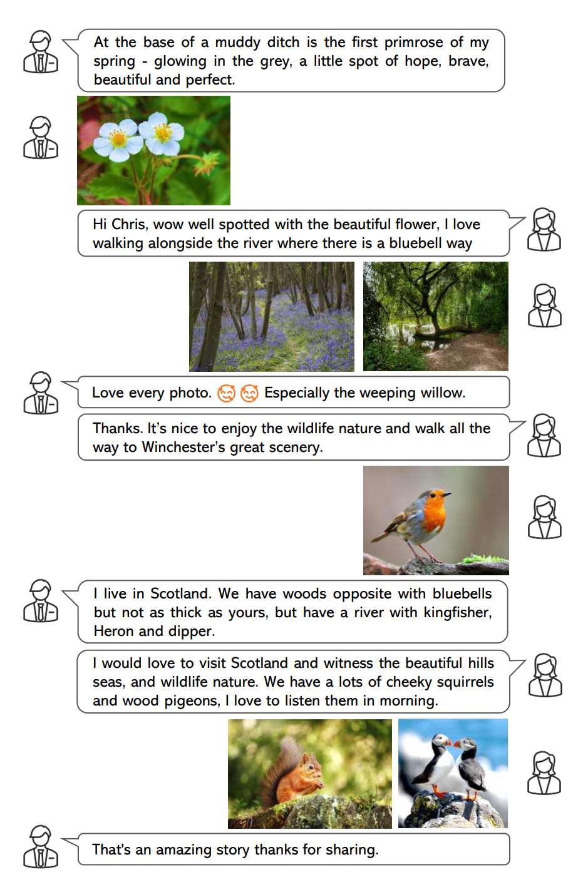
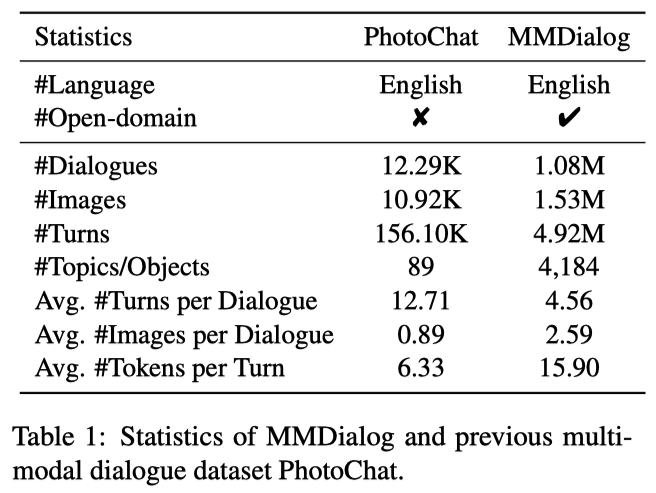
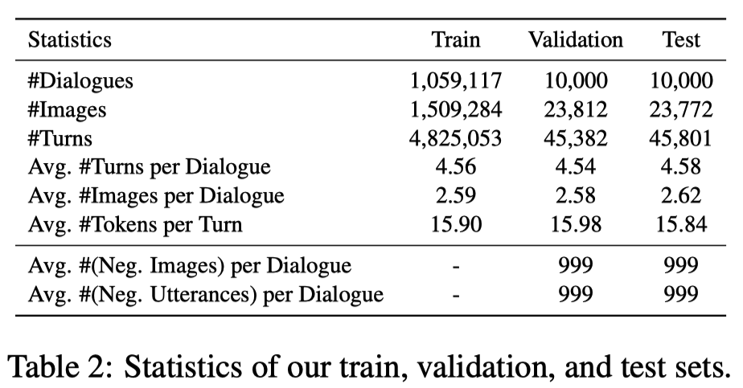
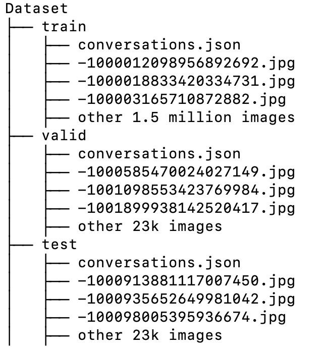
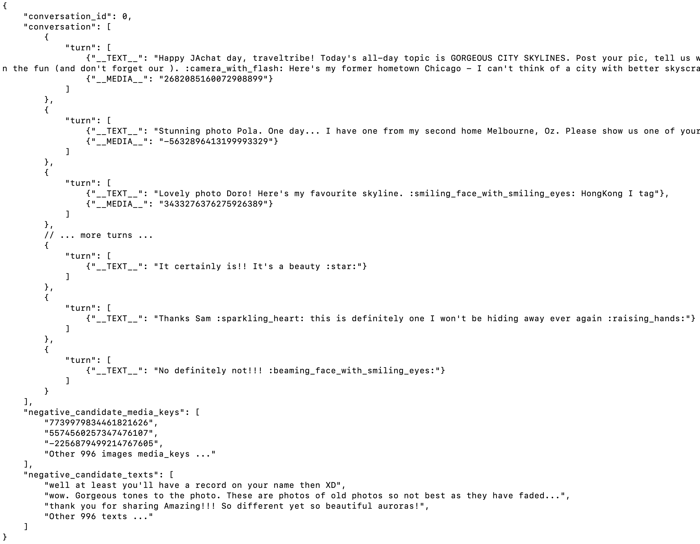

# MMDialog: A Large-scale Multi-turn Dialogue Dataset Towards Multi-modal Open-domain Conversation #


This repository is the official site of [MMDialog: A Large-scale Multi-turn Dialogue Dataset Towards Multi-modal Open-domain Conversation](https://arxiv.org/abs/2211.05719)

## About the dataset

**A Dialogue Case of MMDialog:**




**Statistics:**





If you use it in your work, please cite our paper:
 [](https://arxiv.org/abs/2211.05719) [](https://arxiv.org/pdf/2211.05719.pdf)

```
@article{feng2022mmdialog,
  title={MMDialog: A Large-scale Multi-turn Dialogue Dataset Towards Multi-modal Open-domain Conversation},
  author={Jiazhan Feng, Qingfeng Sun, Can Xu, Pu Zhao, Yaming Yang, Chongyang Tao, Dongyan Zhao, Qingwei Lin},
  journal={arXiv preprint arXiv:2211.05719},
  year={2022}
}
```

**Dataset Folder Format:**



**File: conversations.json**



**Note:** 
1. Training set do not contains "negative_candidate_media_keys" and "negative_candidate_texts", which only exists in test and validation set. Each "negative_candidate_xxx" contains 999 negative candidates for retrieval task.
2. All image filenames are in "media_key.jpg" format.
3. Words like :smiling_face_with_smiling_eyes: and :raising_hands: are emotion tokens, please refer to https://github.com/carpedm20/emoji
4. To compute the CLIP scores in metric MM-Relevance, we provide a demo in compute_mmrel.py
5. We also provide an evaluation example for metrics evaluated within a single modality (e.g., BLEU, Recall) in [EvaluationExample.md](EvaluationExample.md).
## How to get the dataset

### To get this dataset, you and your organization require:
1. Who it's for: You are either a master’s student, doctoral candidate, post-doc, faculty, or research-focused employee at an academic institution or university.
2. Non-commercial use: You should only use this access for non-commercial purposes.
3. Clearly Plan: You have a clearly defined research objective, and you have specific plans for how you intend to use and analyze this data from your research. 
4. Promise your behavior: You should promise you would not share this dataset without our qualification review and permission.

If you don't meet **all of the requirements** above, we **would not** share you the dataset.

### We need you to fill in the form below:

| Item      | Description |
| ----------- | ----------- |
| Your  Name      | [Your name here]       |
| Your  Role      | [master’s student / doctoral candidate / post-doc / faculty / research-focused employee / others]       |
| Your  Study or Work Organization | e.g. Microsoft Research, DeepMind, Cornell University, ...       |
| Your  Personal Academic Homepage **With Publications** | Your [Google Scholar] or [Homepage_URL running on  your organization website (e.g. yourname.people.xxx.edu / yourname.xxx.people.msr.microsoft.com)] with publications. |
| Non-commercial Use  | I [promise / cannot promise] that I will not apply this MMDialog dataset to commercial scenarios or products.  |
| Sharing Limitation  | I [promise / cannot promise] I would not share this MMDialog dataset without your qualification review and permission.  |
| Your Plan      | (Describe your research plan and how you intend to use and analyze this data from your research. **>= 50 words**)   |

Then use your **edu or research email account** to send the form to [v-jiafeng@microsoft.com] for a review, if you meet **all** the requirements, we would share you a cloud folder which stores the pre-processed dataset **within a week**.
